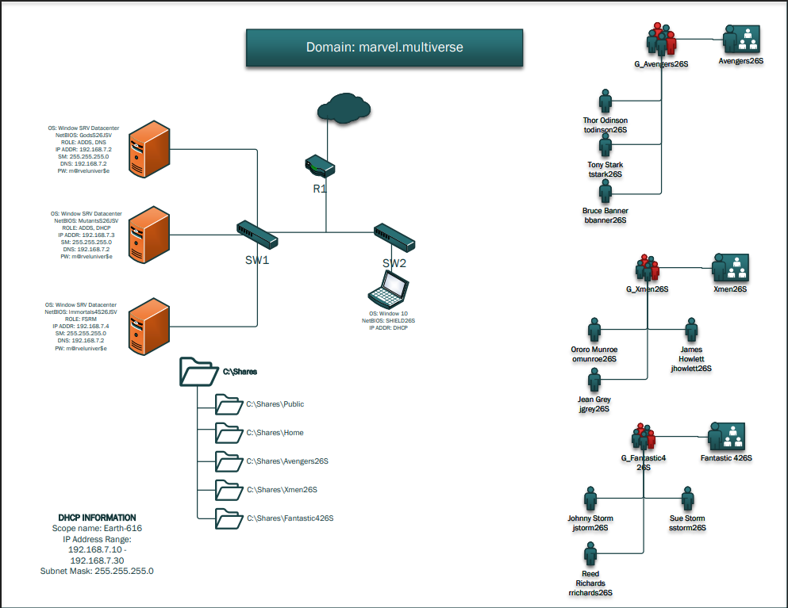
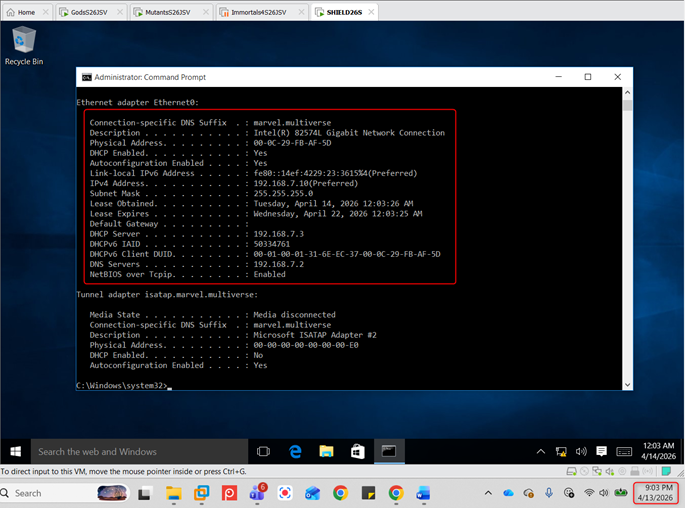

# Marvel-Themed Active Directory Lab (AD DS + DNS + DHCP)
Windows Server lab with AD DS, DNS, DHCP, and File Services using a Marvel-themed domain structure

## 1. Overview
This project is a Windows Server home lab built to simulate a small enterprise environment using Active Directory, DNS, DHCP, and File Services.

To simulate a real enterprise structure, departments were modeled using Marvel teams:

- Avengers → Department A
- X-Men → Department B
- Fantastic Four → Department C

Each group includes:
- Dedicated users
- Security groups
- Organizational Units (OUs)

This demonstrates how logical grouping improves identity and access management in Active Directory.

---

## 2. Environment Architecture

### Servers
- Server 1: Domain Controller (AD DS, DNS)
- Server 2: DHCP Server
- Server 3: File Server

### Client
- Windows 10 machine joined to the domain

### Virtualization
- VMware Workstation Pro 17.5

---

## 3. Network Architecture

This environment simulates a multi-server enterprise network where:
- The Domain Controller handles authentication and DNS
- A dedicated DHCP server manages IP address assignment
- A file server provides centralized storage
- A client machine joins the domain and consumes all services
  

---

## 3. Active Directory Design

### Organizational Units
- Avengers
- X-Men
- Fantastic Four

### Users
- Thor Odinson/todinson26S
- Tony Stark/tstark26S
- Bruce Banner/bbanner26S
- James Howlett/jhowlett26S
- Ororo Munroe/omunroe26S
- Jean Grey/jgrey26S
- Johnny Storm/jstorm26S
- Sue Storm/jstorm26S
- Reed Richards/rrichards26S

### Groups
- G_Avengers26S
- G_Xmen26S
- G_Fantastic426S

---

## 4. Services Configured

### Active Directory
- Domain Controller configured
- Organizational Units created
- Users and groups assigned

### DNS
- Domain-based name resolution configured
- Integrated with Active Directory

### DHCP
- DHCP scope configured on Server 2
- Clients automatically assigned IP addresses

### File Services
- Shared folders created on Server 3
- Folder redirection configured for users

---

## 5. Screenshots

### Organizational Units

### Xmen Users

### Fantastic 4 Users

### Avengers Users

### Group Xmen

### Group Fantastic 4

### Group Avengers

### DHCP Scope

### Client IP Configuration

### File Shares

### Folder Redirection

---

## 6. Skills Demonstrated
- Active Directory administration
- DNS configuration and integration
- DHCP scope configuration and leasing
- File server and shared folder management
- Folder redirection
- Multi-server environment deployment

---

## 7. Real-World Relevance

This lab reflects real enterprise infrastructure where:
- Active Directory manages authentication and authorization
- DNS enables internal name resolution
- DHCP automates network configuration
- File servers centralize user data

These services form the foundation of most corporate IT environments.

---

## 8. Future Improvements
- Add Group Policy Objects (GPOs)
- Add PowerShell automation
- Add SIEM for monitoring
- Add security auditing (login tracking)
